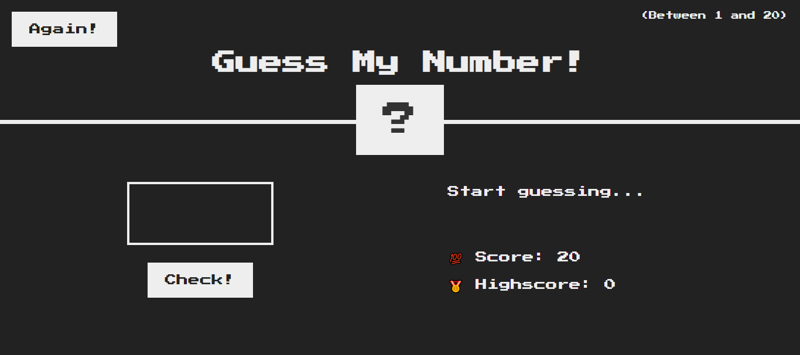
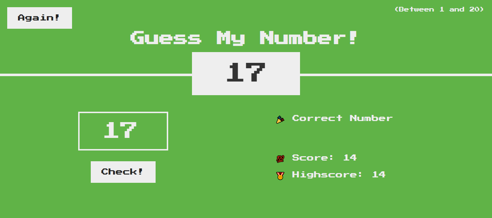

# Guess My Number Game 🎯

A simple number guessing game built using JavaScript.

## 🎮 How It Works

* The system generates a random number
* The player guesses the number
* Feedback is given:

  * Too high 📈
  * Too low 📉
* Score decreases with wrong guesses

## ✨ Features

* Score tracking
* High score system
* Interactive UI

## 🛠️ Technologies

* HTML
* CSS
* JavaScript

## 🚀 How to Play

Open `index.html` in your browser and start guessing!

## 📸 Screenshots:

GAME START :

CORRECT GUESS :

