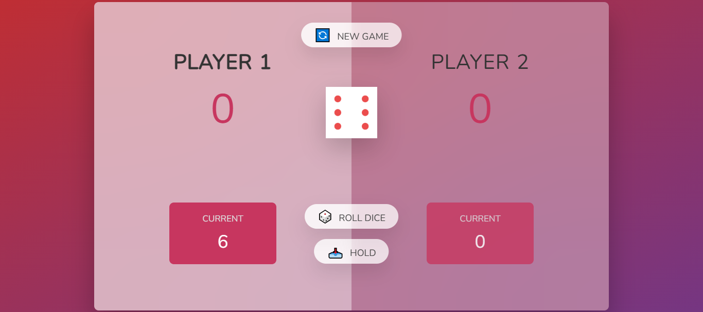
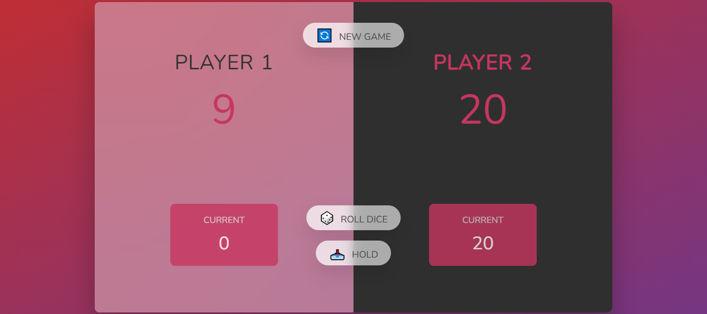

# Pig Game 🎲

A fun two-player dice game built with JavaScript.

## 🎮 Game Rules

* Players take turns rolling a dice
* Each roll adds to the current score
* Rolling a **1** resets the current score and switches player
* Players can "Hold" to save their score
* First player to reach the winning score wins

## ✨ Features

* Two-player gameplay
* Dynamic score updates
* Game reset functionality

## 🛠️ Technologies

* HTML
* CSS
* JavaScript

## 🚀 How to Play

Open `index.html` in your browser and enjoy the game!

## 📸 Screenshots:

PREVIEW 1 :

PREVIEW 2 :

